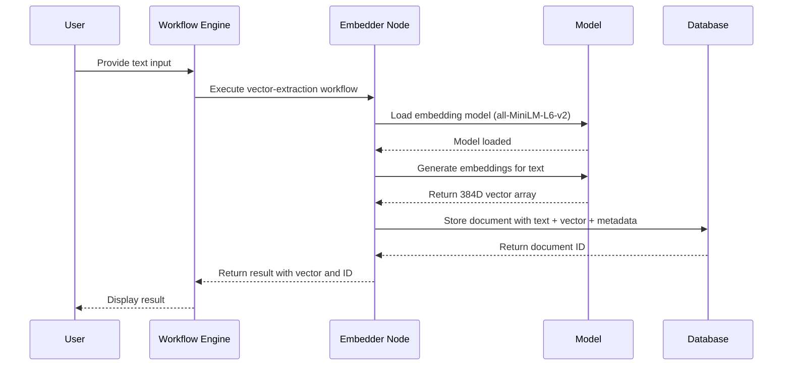
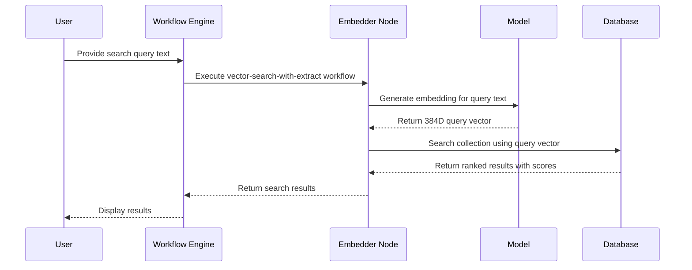

# Design Document: Vector Extraction Feature

## Overview

This document defines the design for extending the vector-db-demo showcase with vector extraction capability using the local-ai-candle bit. The feature enables users to generate 384-dimensional vector embeddings from text input using local BERT-family models, which can then be stored in the vector database for similarity search.

## Architecture

### System Components

```mermaid
graph TB
    subgraph "User Interface"
        UI[Workflow Input Form]
    end
    
    subgraph "Vector Extraction Workflow"
        VE[Vector Extract Node]
    end
    
    subgraph "Local AI Layer"
        LA[local-ai-node<br/>TextEmbedder]
        MC[Model Cache]
    end
    
    subgraph "Vector Storage"
        DB[(SQLite Vector Store)]
        COLL[Collections:<br/>- items (4D)<br/>- words (4D)<br/>- embeddings (384D)]
    end
    
    UI --> VE
    VE --> LA
    LA --> MC
    LA --> DB
    DB --> COLL
```

### Component Responsibilities

| Component | Responsibility |
|-----------|----------------|
| Workflow Input | Accepts text input, optional metadata (tag, category) |
| Vector Extract Node | Orchestrates embedding generation and storage |
| local-ai-node TextEmbedder | Loads BERT model, generates 384D embeddings |
| Model Cache | Keeps model loaded in memory for subsequent calls |
| Vector Store | Persists documents with text, vector, and metadata |

## Data Flow

### Vector Extraction Flow



### Search Flow



## Components and Interfaces

### Workflow: vector-extract

Extracts vector embedding from text and stores it in the vector database.

**File:** `showcase/vector-db-demo/habits/vector-extract.yaml`

```yaml
id: vector-extract
name: Vector Extract
description: Generate vector embedding from text and store in vector database

nodes:
  - id: embed-text
    type: bits
    data:
      framework: bits
      source: npm
      module: "@local-ai/node"
      operation: embed_texts
      params:
        model_path: "{{models.all-MiniLM-L6-v2.path}}"
        tokenizer_path: "{{models.all-MiniLM-L6-v2.tokenizer}}"
        config_path: "{{models.all-MiniLM-L6-v2.config}}"
        texts: ["{{habits.input.text}}"]
        normalize: "{{habits.input.normalize}}"
        mean_pool: "{{habits.input.mean_pool}}"
        device: "Auto"

  - id: store-document
    type: bits
    data:
      framework: bits
      source: npm
      module: "@ha-bits/bit-database-sql"
      operation: vectorInsert
      params:
        collection: "embeddings"
        document:
          text: "{{habits.input.text}}"
          tag: "{{habits.input.tag}}"
          category: "{{habits.input.category}}"
          vector: "{{embed-text.embeddings[0]}}"

output: "{{store-document}}"

input:
  - id: text
    type: string
    displayName: "Text to Embed"
    required: true
    description: "Input text to generate vector embedding"
  - id: tag
    type: string
    displayName: "Tag"
    required: false
    description: "Optional tag for categorization"
  - id: category
    type: string
    displayName: "Category"
    required: false
    description: "Optional category"
  - id: normalize
    type: boolean
    displayName: "L2 Normalize"
    default: true
    description: "Whether to L2-normalize output vectors"
  - id: mean_pool
    type: boolean
    displayName: "Mean Pooling"
    default: true
    description: "Use mean pooling (true) or CLS token (false)"
```

### Workflow: vector-search-with-extract

Searches for similar documents by first extracting the query vector, then performing similarity search.

**File:** `showcase/vector-db-demo/habits/vector-search-with-extract.yaml`

```yaml
id: vector-search-with-extract
name: Vector Search (with Extract)
description: Search for similar documents using text query converted to vector

nodes:
  - id: embed-query
    type: bits
    data:
      framework: bits
      source: npm
      module: "@local-ai/node"
      operation: embed_texts
      params:
        model_path: "{{models.all-MiniLM-L6-v2.path}}"
        tokenizer_path: "{{models.all-MiniLM-L6-v2.tokenizer}}"
        config_path: "{{models.all-MiniLM-L6-v2.config}}"
        texts: ["{{habits.input.query}}"]
        normalize: "{{habits.input.normalize}}"
        mean_pool: "{{habits.input.mean_pool}}"
        device: "Auto"

  - id: do-search
    type: bits
    data:
      framework: bits
      source: npm
      module: "@ha-bits/bit-database-sql"
      operation: vectorSearch
      params:
        collection: "embeddings"
        vector: "{{embed-query.embeddings[0]}}"
        limit: "{{habits.input.limit}}"
        distance: "{{habits.input.distance}}"

output: "{{do-search}}"

input:
  - id: query
    type: string
    displayName: "Search Query"
    required: true
    description: "Text to search for"
  - id: limit
    type: number
    displayName: "Max Results"
    default: 5
  - id: distance
    type: string
    displayName: "Distance Metric"
    default: "cosine"
    options: ["l2", "cosine", "l1"]
  - id: normalize
    type: boolean
    displayName: "L2 Normalize"
    default: true
  - id: mean_pool
    type: boolean
    displayName: "Mean Pooling"
    default: true
```

### Workflow: vector-extract-batch

Extracts vectors from multiple texts in a single operation for efficiency.

**File:** `showcase/vector-db-demo/habits/vector-extract-batch.yaml`

```yaml
id: vector-extract-batch
name: Vector Extract (Batch)
description: Generate vector embeddings for multiple texts and store in vector database

nodes:
  - id: embed-texts
    type: bits
    data:
      framework: bits
      source: npm
      module: "@local-ai/node"
      operation: embed_texts
      params:
        model_path: "{{models.all-MiniLM-L6-v2.path}}"
        tokenizer_path: "{{models.all-MiniLM-L6-v2.tokenizer}}"
        config_path: "{{models.all-MiniLM-L6-v2.config}}"
        texts: "{{habits.input.texts}}"
        normalize: "{{habits.input.normalize}}"
        mean_pool: "{{habits.input.mean_pool}}"
        device: "Auto"

  - id: store-documents
    type: bits
    data:
      framework: bits
      source: npm
      module: "@ha-bits/bit-database-sql"
      operation: vectorInsert
      params:
        collection: "embeddings"
        document:
          text: "{{habits.input.text}}"
          tag: "{{habits.input.tag}}"
          category: "{{habits.input.category}}"
          vector: "{{embed-texts.embeddings[$index]}}"

output: "{{store-documents}}"

input:
  - id: texts
    type: array
    displayName: "Texts to Embed"
    required: true
    description: "Array of text strings to generate embeddings for"
  - id: tag
    type: string
    displayName: "Tag"
    required: false
  - id: category
    type: string
    displayName: "Category"
    required: false
  - id: normalize
    type: boolean
    displayName: "L2 Normalize"
    default: true
  - id: mean_pool
    type: boolean
    displayName: "Mean Pooling"
    default: true
```

## Data Models

### Document Schema (embeddings collection)

| Field | Type | Description |
|-------|------|-------------|
| id | string | Auto-generated document ID |
| text | string | Original input text |
| vector | float[384] | 384-dimensional embedding vector |
| tag | string (optional) | User-provided tag |
| category | string (optional) | User-provided category |
| created_at | timestamp | Creation timestamp |

### Embedding Configuration

| Parameter | Type | Default | Description |
|-----------|------|---------|-------------|
| model_path | string | required | Path to safetensors model file |
| tokenizer_path | string | required | Path to tokenizer.json |
| config_path | string | required | Path to config.json |
| normalize | boolean | true | L2-normalize output vectors |
| mean_pool | boolean | true | Mean-pool over tokens (false = CLS) |
| device | string | "Auto" | Device: Auto, Cpu, Metal, Cuda |

### Embedding Result

| Field | Type | Description |
|-------|------|-------------|
| embeddings | float[][] | Array of embedding vectors |
| dimensions | uint | Vector dimensionality (384) |
| device_used | string | Device used for inference |

## Integration Points

### Stack Configuration Update

The new workflows must be registered in `stack.yaml`:

```yaml
version: "1.0"
name: "Vector DB Demo"
workflows:
  - id: vector-insert
    path: ./habits/insert.yaml
    enabled: true
  - id: vector-search
    path: ./habits/search.yaml
    enabled: true
  - id: vector-delete
    path: ./habits/delete.yaml
    enabled: true
  - id: seed-words
    path: ./habits/seed-words.yaml
    enabled: true
  - id: find-word
    path: ./habits/find-word.yaml
    enabled: true
  # New vector-extraction workflows
  - id: vector-extract
    path: ./habits/vector-extract.yaml
    enabled: true
  - id: vector-search-with-extract
    path: ./habits/vector-search-with-extract.yaml
    enabled: true
  - id: vector-extract-batch
    path: ./habits/vector-extract-batch.yaml
    enabled: true
```

### Model Registry

The embedding model configuration should be available in the workflow context:

```yaml
models:
  all-MiniLM-L6-v2:
    path: "./models/all-MiniLM-L6-v2/model.safetensors"
    tokenizer: "./models/all-MiniLM-L6-v2/tokenizer.json"
    config: "./models/all-MiniLM-L6-v2/config.json"
    dimensions: 384
```

### Collection Separation

To avoid dimension mismatch with existing 4D data:

- **Existing collections** (`items`, `words`): 4D vectors (for demo purposes)
- **New collection** (`embeddings`): 384D vectors (from local-ai-candle)

This separation ensures compatibility with existing workflows while enabling semantic search.

## Technical Considerations

### 384D vs 4D Vectors

| Aspect | 4D Vectors | 384D Vectors |
|--------|------------|--------------|
| Dimensions | 4 | 384 |
| Semantic Meaning | Synthetic/demo | Real semantic embeddings |
| Model | Predefined | all-MiniLM-L6-v2 |
| Use Case | Demo similarity | Real semantic search |
| Storage | Same | Same (array of floats) |

### Performance Considerations

1. **Model Loading**: The embedding model is loaded once and kept in memory via the `JsTextEmbedder` class. Subsequent calls reuse the loaded model.

2. **Batch Processing**: For multiple texts, use the batch workflow to avoid loading the model multiple times.

3. **Device Selection**: 
   - macOS: Uses Metal GPU acceleration automatically
   - Linux/Windows with NVIDIA: Uses CUDA
   - Fallback: CPU

4. **Normalization**: L2 normalization is enabled by default, which is important for cosine similarity search.

### Error Handling

| Error Condition | Handling |
|-----------------|----------|
| Empty text input | Return error: "Text input is required" |
| Model not found | Return error: "Embedding model not found at path: {path}" |
| Tokenizer not found | Return error: "Tokenizer not found at path: {path}" |
| Unsupported platform | Return error: "Local AI is not supported on this platform" |
| Vector storage failure | Return database error with details |

## Correctness Properties

*A property is a characteristic or behavior that should hold true across all valid executions of a system—essentially, a formal statement about what the system should do. Properties serve as the bridge between human-readable specifications and machine-verifiable correctness guarantees.*

### Property 1: Embedding Dimension Consistency

*For any* valid text input processed by the embedding node, the output vector SHALL have exactly 384 dimensions when using the default all-MiniLM-L6-v2 model.

**Validates: Requirements 1.3**

### Property 2: Vector Storage Preservation

*For any* document stored in the embeddings collection, retrieving it SHALL return the exact same vector that was stored.

**Validates: Requirements 2.1, 2.3**

### Property 3: Search Query Vector Extraction

*For any* search query text, the extracted query vector SHALL produce semantically similar results when compared against stored documents with similar meaning.

**Validates: Requirements 3.1, 3.2**

### Property 4: Normalization Consistency

*For any* text input, when normalize is set to true, the output vector SHALL have an L2 norm of 1.0.

**Validates: Requirements 1.4**

### Property 5: Batch Processing Completeness

*For any* array of N text inputs processed in batch mode, the output SHALL contain exactly N embedding vectors, each with 384 dimensions.

**Validates: Requirements 1.2**

### Property 6: Mean Pooling Behavior

*For any* text input, when mean_pool is set to true, the output vector SHALL be computed by averaging all token embeddings; when set to false, the output SHALL use the CLS token embedding.

**Validates: Requirements 1.5**

### Property 7: Metadata Preservation

*For any* document stored with tag and category metadata, retrieving that document SHALL return the exact same tag and category values.

**Validates: Requirements 2.2**

### Property 8: Model Selection

*For any* valid model configuration (model_path, tokenizer_path, config_path), the embedder SHALL load and use that specific model for embedding generation.

**Validates: Requirements 4.3**

### Property 9: Cross-Operation Compatibility

*For any* document stored in the embeddings collection with a 384-dimensional vector, the existing vector-search workflow SHALL be able to search against it using a compatible query vector.

**Validates: Requirements 6.3**

## Error Handling

### Error Types

| Error Code | Description | User Message |
|------------|-------------|---------------|
| EMPTY_INPUT | Text input is empty or whitespace | "Text input is required and cannot be empty" |
| MODEL_NOT_FOUND | Model file not at specified path | "Embedding model not found. Please ensure the model is installed." |
| TOKENIZER_NOT_FOUND | Tokenizer file not found | "Tokenizer not found. Please ensure the model is properly installed." |
| UNSUPPORTED_PLATFORM | Platform not supported | "Local AI is not supported on this platform" |
| STORAGE_ERROR | Database operation failed | "Failed to store document: {error details}" |
| DIMENSION_MISMATCH | Vector dimension mismatch | "Vector dimension mismatch: expected 384, got {actual}" |

### Error Response Format

```json
{
  "success": false,
  "error": {
    "code": "MODEL_NOT_FOUND",
    "message": "Embedding model not found. Please ensure the model is installed.",
    "details": {
      "path": "/path/to/model.safetensors"
    }
  }
}
```

## Testing Strategy

### Dual Testing Approach

**Unit Tests:**
- Test embedding dimension output (384D)
- Test normalization behavior
- Test error handling for invalid inputs
- Test batch processing with various input sizes

**Property Tests:**
- Test that embedding extraction is deterministic for the same input
- Test that vector storage preserves exact values (round-trip)
- Test that similar texts produce more similar vectors than dissimilar texts

### Test Configuration

- Minimum 100 iterations per property test
- Test tag format: **Feature: vector-extraction, Property {number}: {property_text}**

### Test Categories

| Category | Test Type | Examples |
|----------|-----------|----------|
| Embedding Generation | Unit + Property | Dimension check, round-trip preservation |
| Vector Storage | Unit | Insert, retrieve, dimension check |
| Search | Integration | Query extraction, similarity ranking |
| Error Handling | Unit | Empty input, missing model, invalid path |
| Batch Processing | Unit + Property | Multiple texts, dimension consistency |

### Model Availability Testing

Since the embedding model is an external dependency:
- Integration tests should verify model files exist before running
- Smoke tests should confirm the model can be loaded
- Mock-based unit tests can verify workflow logic without the model