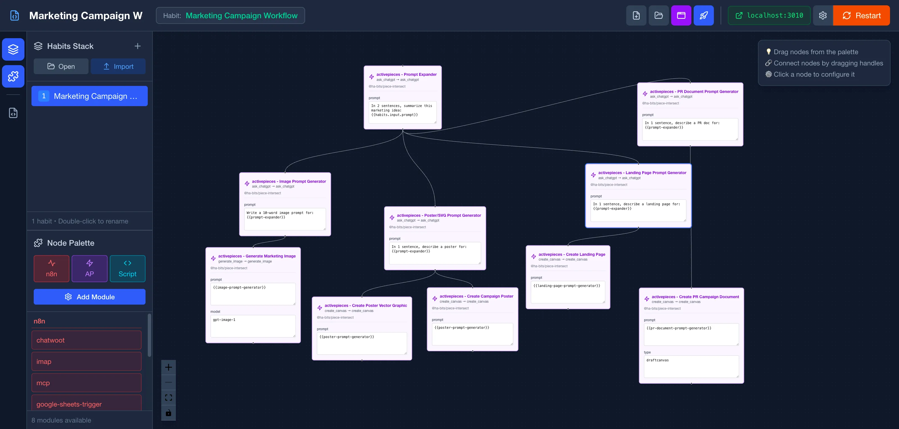
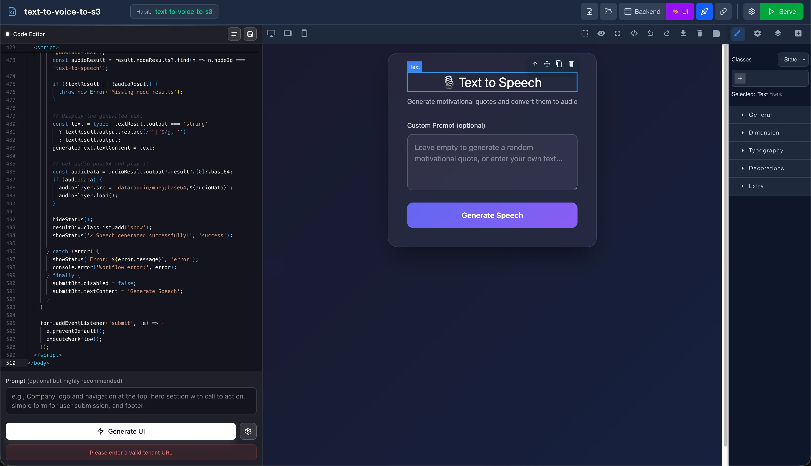
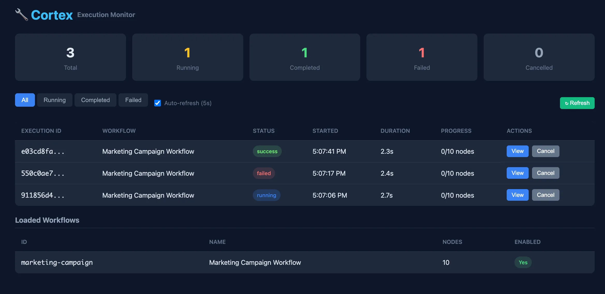
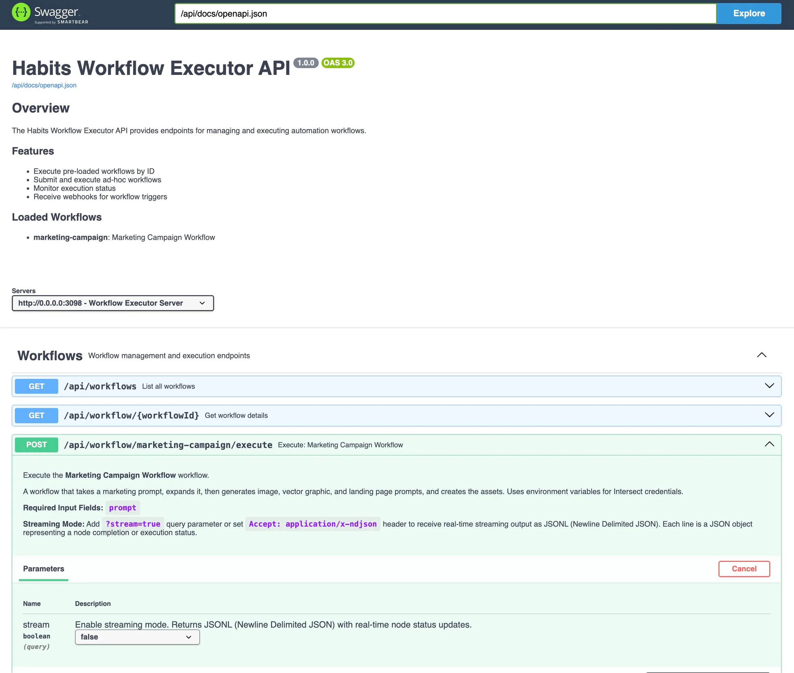
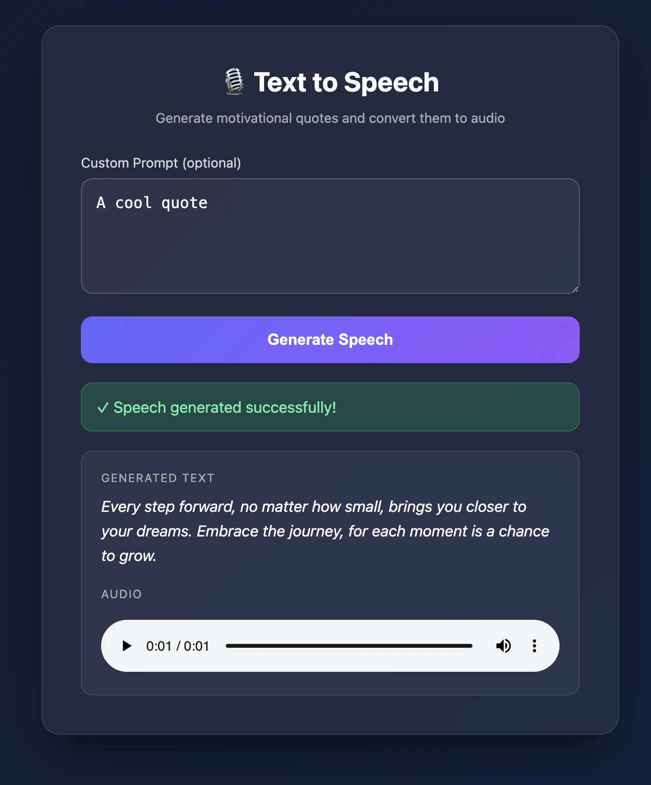

# Habits

[](LICENSE.md)
[](https://nodejs.org/)

Habits allows you to create Agents, Automations, Full-Stacks, SaaS and Micro-Apps. 

Under the hood Habits is an AI Logic & UI builder (Base, from Basal Ganglia) and decentralized runner (Cortex, as in Frontal Cortex) that you can control, audit, monitor and extend (Apache 2.0)
<p align="center">
  
</p>
<p align="center">
  
</p>

## Table of Contents

- [What is Habits?](#what-is-habits)
- [Features](#features)
- [Quick Start](#quick-start)
  - [Installation](#installation)
  - [Create Your First Habit](#create-your-first-habit)
  - [Run the Server](#run-the-server)
- [Architecture](#architecture)
- [Examples](#examples)
- [Screenshots](#screenshots)
- [When to Use Habits](#when-to-use-habits)
- [Enabling Features](#enabling-features)
- [License Considerations](#license-considerations)
- [Documentation](#documentation)
- [Development](#development)
- [Project Structure](#project-structure)
- [Contributing](#contributing)
- [License](#license)

## What is Habits?

Habits is a **lightweight workflows creator, runtime, and packer**, designed for environments where full platforms are overkill: serverless functions, edge computing, embedded systems, or when you want to bundle automation into your own SaaS product.

| Component | Role | Description |
|-----------|------|-------------|
| **Habit** | Workflow | A complete routine composed of connected nodes |
| **Stack** | Workflow Set | A collection of habits executed together |
| **Bit** | Node | A single step: a bit, ActivePieces piece, n8n node, or script |
| **Base** | Builder | Visual workflow designer for constructing habits |
| **Cortex** | Executor | The orchestration engine that runs everything |

## Features

- **Multi-Framework Support** - Combine ActivePieces pieces, n8n nodes, custom bits, and scripts in a single workflow
- **True Open Source (Apache 2.0)** - Embed in commercial products, distribute without restrictions
- **Flexible Execution** - Run via CLI, REST API, or with an auto-generated frontend
- **Dynamic Module Loading** - Install modules from npm, GitHub, or local sources on-the-fly
- **Lightweight** - Minimal footprint, perfect for serverless and edge deployments
- **Security** - Built-in DLP, PII protection, supply chain integrity, and sandboxing

## Quick Start

### Installation

```bash
# Using curl
curl -o- https://codenteam.com/intersect/habits/install.sh | bash

# Or using npx (no installation needed)
npx habits@latest

# Or if cloned
pnpm install
pnpm nx dev @ha-bits/base-ui 
pnpm nx dev @ha-bits/base
```

> **Note:** On first startup, Habits will clone required bits and modules. This may take a minute, please wait until initialization completes before running workflows.


### Create Your First Habit

Create a project folder with the following structure:

```
my-automation/
├── .env
├── stack.yaml
└── habit.yaml
```

See the [mixed example](examples/mixed) for a complete working setup:
- [stack.yaml](examples/mixed/stack.yaml) - Server configuration and workflow paths
- [habit.yaml](examples/mixed/habit.yaml) - Workflow definition with nodes
- [.env.example](examples/mixed/.env.example) - Environment variables template

### Run the Server

```bash
# Using habits CLI
habits cortex --config ./stack.yaml

# Or using npx
npx habits@latest cortex --config ./stack.yaml
```

Then call your workflow:

```bash
curl -X POST http://localhost:13000/api/text-to-voice-to-s3
```

## Architecture

Habits is composed of two main components:

```
┌─────────────────────────────────────────────────────┐
│                     Habits                          │
├─────────────────────┬───────────────────────────────┤
│        Base         │          Cortex               │
│   (Visual Builder)  │    (Execution Engine)         │
├─────────────────────┼───────────────────────────────┤
│  • Drag-and-drop    │  • CLI execution              │
│  • Export to YAML   │  • REST API server            │
│  • Frontend builder │  • Multi-framework support    │
│  • Template library │  • Dynamic module loading     │
└─────────────────────┴───────────────────────────────┘
```

## Examples

| Example | Description | Key Features |
|---------|-------------|--------------|
| [Mixed](examples/mixed) | Multi-framework demo | OpenAI + ElevenLabs + local save |
| [Minimal Blog](examples/minimal-blog) | Blog API backend | CRUD endpoints + database |
| [Email Classification](examples/email-classification) | Smart email router | Branching logic, IMAP/HTTP input |
| [AI Cookbook](examples/ai-cookbook) | AI recipe generator | Ingredients to recipes, images |

Run any example:

```bash
cd examples/mixed
npx habits@latest cortex --config ./stack.yaml
```

## Screenshots

### Cortex Management UI


### Base Frontend Builder


### Swagger API Documentation


### Example Frontend (Text-to-Audio)


## When to Use Habits

**Use Habits when you need:**
- Serverless & edge deployments (AWS Lambda, Cloudflare Workers)
- Embedding workflows in your SaaS product
- A fully open-source stack (Apache 2.0 + MIT)
- Mixed framework workflows (Bits + ActivePieces + n8n + scripts)
- CLI/REST API workflow for CI/CD pipelines

**Use n8n or ActivePieces directly when you need:**
- A full visual builder with all features
- A managed/hosted platform
- Built-in monitoring and team features

## Enabling Features

| Feature | Environment Variable | Endpoint |
|---------|---------------------|----------|
| Swagger API | `HABITS_OPENAPI_ENABLED=true` | `/api/docs` |
| Management Portal | `HABITS_MANAGE_ENABLED=true` | `/manage` |
| Frontend | Set `frontend` in stack.yaml | `/` |

## License Considerations

| Module Source | License | Safe to Distribute? |
|--------------|---------|---------------------|
| Habits core | Apache 2.0 | Yes |
| ActivePieces pieces | MIT | Yes |
| Community n8n nodes | Usually MIT | Check each |
| n8n-nodes-base | Sustainable Use | No |

Stick to Apache 2.0 or MIT licensed modules for maximum freedom.

## Documentation

📚 **[View full documentation](https://codenteam.com/intersect/habits)**

Local documentation available at [docs](docs/):

## 📖 Documentation

- [Introduction](https://codenteam.com/intersect/habits/getting-started/introduction.html) ([Source](docs/getting-started/introduction.md))
- [First Habit](https://codenteam.com/intersect/habits/getting-started/first-habit.html) ([Source](docs/getting-started/first-habit.md))
- [Concepts](https://codenteam.com/intersect/habits/getting-started/concepts.html) ([Source](docs/getting-started/concepts.md))
- [Running Automations](https://codenteam.com/intersect/habits/deep-dive/running.html) ([Source](docs/deep-dive/running.md))
- [Creating Habits](https://codenteam.com/intersect/habits/deep-dive/creating.html) ([Source](docs/deep-dive/creating.md))


## Development

```bash
# Clone the repository
git clone https://github.com/codenteam/habits.git
cd habits

# Install dependencies
pnpm install

# Run Cortex in dev mode
pnpm nx dev @ha-bits/cortex --config examples/mixed/stack.yaml

# Run Base (visual builder)
pnpm nx dev @ha-bits/base
```

## Project Structure

```
habits/
├── packages/
│   ├── cortex/      # Execution engine
│   ├── base/        # Visual builder
│   ├── bits/        # Custom nodes
│   ├── core/        # Shared utilities
│   └── habits/      # CLI tool
├── examples/        # Example workflows
├── docs/            # Documentation
└── schemas/         # YAML/JSON schemas
```

## Contributing

Contributions are welcome! Please read the documentation and ensure your changes follow the existing code style.

## License

Apache 2.0 - See [LICENSE.md](LICENSE.md) for details.

---

Built by [Codenteam](https://codenteam.com)
