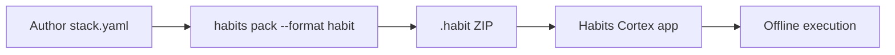

## Pack command

```bash
npx habits pack --config ./stack.yaml --format habit -o ./my-app.habit
```

## Base UI export

Export → **Generate .habit File** → import into Habits Cortex.

## Server hosting

For API/server deployment, use `npx habits cortex --config ./stack.yaml` — not Base export.
